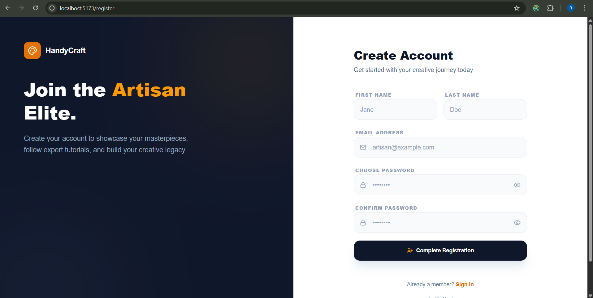
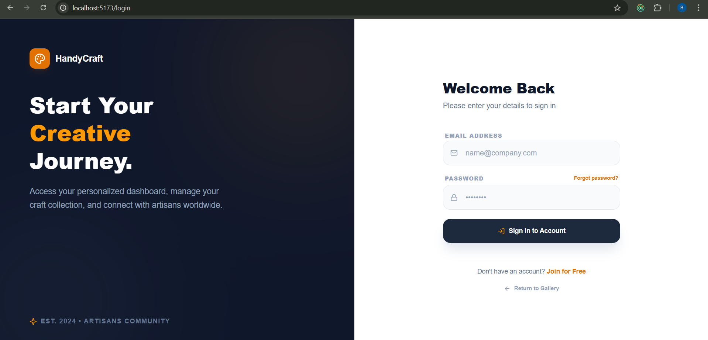
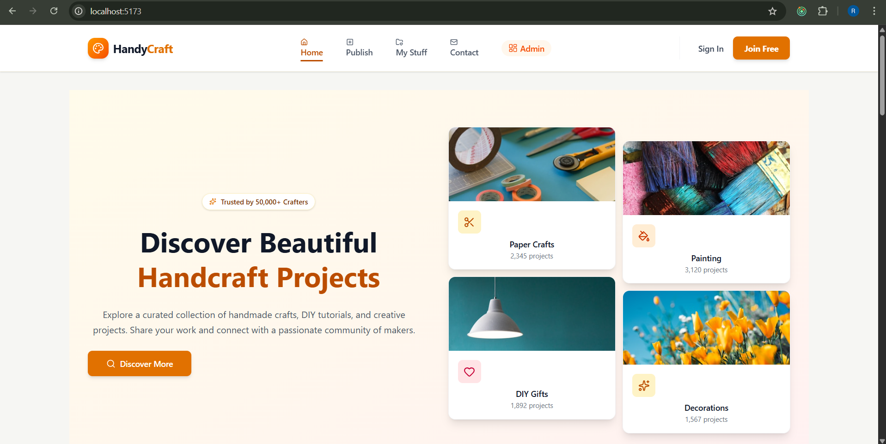
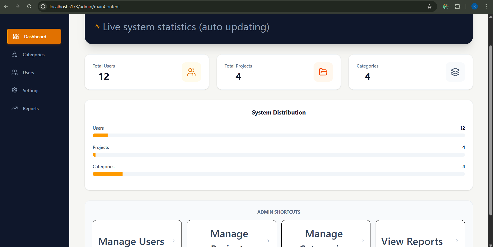
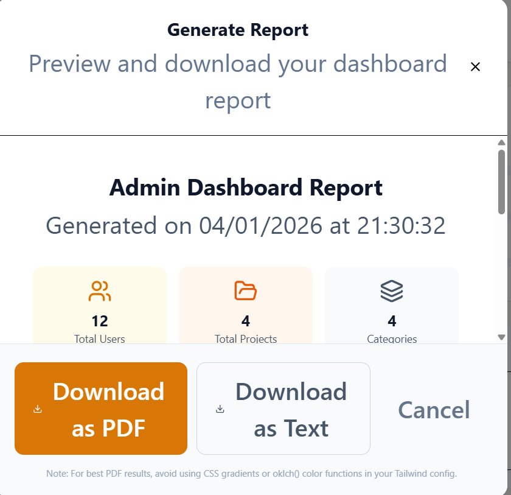
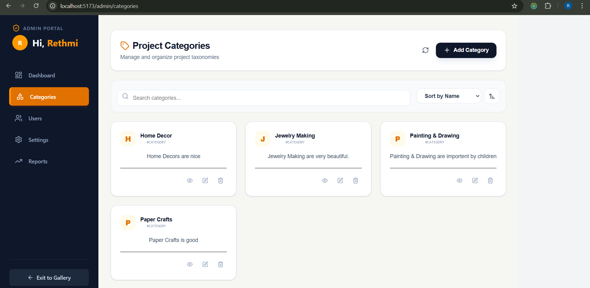
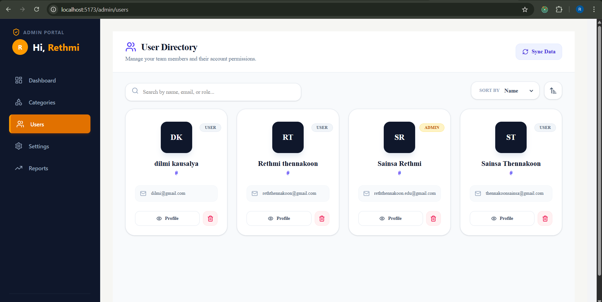
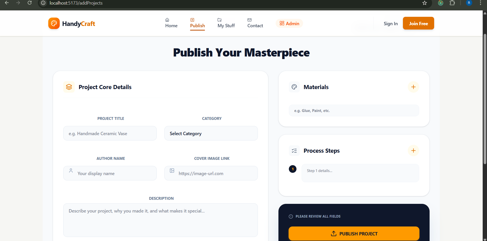
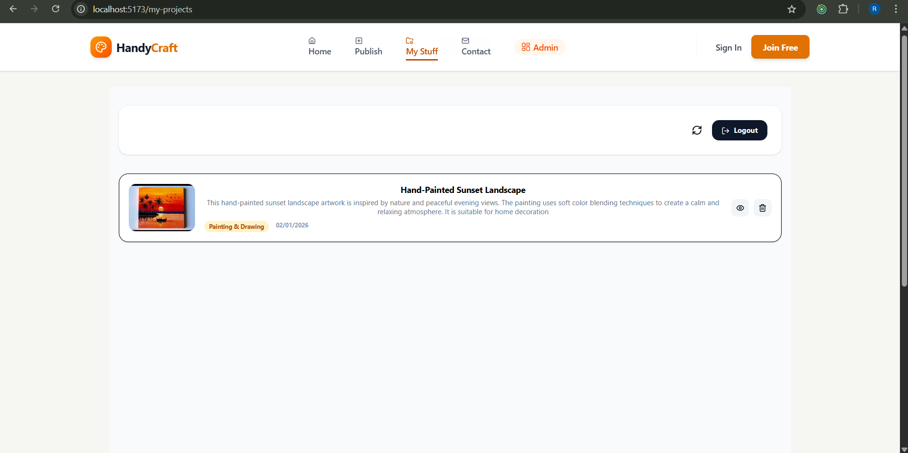
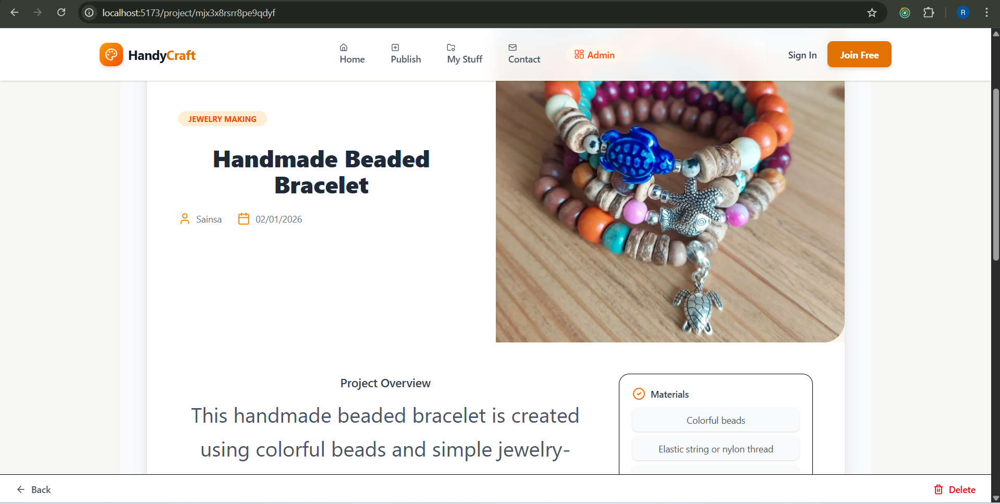

🎨 Hand_Spire_Collective

📌 Project Description

Hand_Spire_Collective is a full-stack web application designed to connect artists, crafters, and customers on a single creative platform. Users can explore diverse creative categories such as painting, jewelry making, paper crafts, and more.

The system provides secure authentication, role-based access control (Admin & User), category and project management, and a modern, fully responsive user interface.

This project was developed as part of an academic / software development assignment, with a strong focus on:

              Clean and modern UI/UX design

              RESTful API architecture

              Full CRUD functionality

              Secure authentication and authorization

🛠️ Technologies & Tools Used
🎯 Frontend

    ⚛️ React + TypeScript

    🎨 Tailwind CSS

    🧠 Redux Toolkit

    🧭 React Router DOM

    🖼️ Lucide Icons

    🌐 Axios

⚙️ Backend

    🟢 Node.js

    🚀 Express.js

    🍃 MongoDB

    📦 Mongoose

    🔐 JWT Authentication

    ☁️ Cloudinary (Image Uploads)

    🧰 Tools & Platforms

    💻 VS Code

    🧪 Postman

    🗂️ Git & GitHub

    🌍 MongoDB Atlas

🚀 Vercel (Backend Deployment)

🌐 Vercel (Frontend Deployment)

⚙️ Setup & Run Instructions
🔹 Backend Setup

1. Clone the repository
	git clone https://github.com/Rethmi/HandSpireCollective_Backend.git
 
2. Install dependencies
	npm install

 
3. Configure environment variables (`.env`)

4. Run the backend server
	npm run dev
 

Backend will run on:
 	http://localhost:5000
 

🔹 Frontend Setup

1. Clone the frontend repository
	https://github.com/Rethmi/HandSpireCollective_Frontend.git
 

2. Install dependencies
	npm install
	

3. Start the development server
	npm run dev
 

Frontend will run on:
	http://localhost:5173
 

🌍 Deployed URLs

	Frontend: hand-spire-collective-frontend.vercel.app
	Backend : hand-spire-collective-backend.vercel.app
 

  ✨ Main Features

  👤 User Features

* User registration & login (JWT authentication)
* Browse creative categories and items
* Search and filter crafts
* View detailed product pages
* Responsive UI for all devices

  🛡️ Admin Features

* Admin dashboard
* Category management (Add / Update / Delete)
* User management
* Secure role-based access

  🎨 UI & UX

* Modern glassmorphism design
* Smooth animations and transitions
* Icon-based navigation
* Dark theme interface

🖼️ Screenshots

  📝 Register Page

  🔐 Login Page

  🏠 Home Page

 
 🛠️ Admin Dashboard

  📊 Generate Report Page

  📂 Category Page

  👥 User Management Page

  ➕ Add Project Page

  🎨 My Projects Page

  🔍 View Project Details Page

  👩‍💻 Author

**Sainsa Rethmi Thennakoon**
 

 

 
